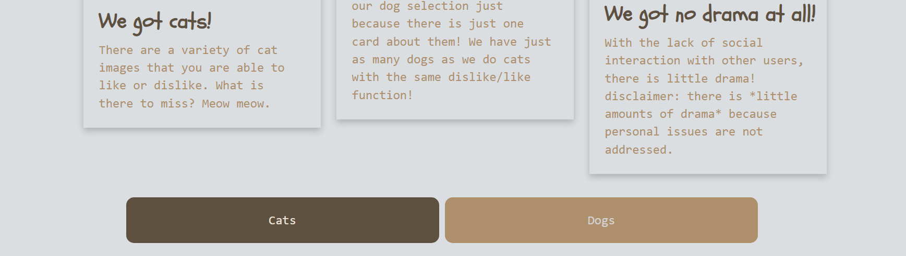

<<<<<<< HEAD
A webpage used by educators in order to request for school supplies to help aid their students for the school year. It features a home page, which informs the user about the goals of this organization, and two buttons that link the user to a request form or a donations page. The request form will allow the educator in need to input their information, which upon submission will take them to a page where they can input the items they need. Once that is over, it takes them to a page filled with cards (from other educators in need (demo)) and stores the information for the donators to look at. 
From the donation button, however, it takes them straight to the card page which they can interact with, pick the person they want to donate items to, and features a button to declare whether they have donated or not. Once donated, it takes the person to a thanks page which redirects them to the home page. 
The javascript featured will store information that the educator inputs, regurgitate it into cards that a donator can pick, and allow the donator to cross out respective donations. 
=======
# 🐾Animals-R-Us 

## Quick Overview

Our site provides users with a safe space where they can vote for either dog or cat images and express their opinions about those images by clicking the "👍 LOVE IT" button or the "👎 DON'T LOVE IT" button, without the distractions of other social media contents. 

## Installation Instructions

Launch website through default browser.

## User Guide

To utilize this website, user can read the front page, which provides a brief overview of the site's objectives.

When the user reaches the bottom of the home page, the user then has the option to click on either the "Cats" or "Dogs" button, once they chose and click on either button they will then be brought to a screen that displays the animal they selected.

On both the cats and dogs pages, there will be images of the animal which the user has chosen, along with two buttons, "👍Love it" and "👎Don't love it", so that the user can choose which image they prefer.

(ADD SS OF BOTH CAT AND DOG PAGE)

## Creators 
- Leonel Solis [@Solis07](https://github.com/Solis07) 
- Brandon Williams [@Bwilliams-88](https://github.com/Bwilliams-88) 
- Ella [@aceiln](https://github.com/aceiln) 
- Alison Standridge [@astand02](https://github.com/astand02)
>>>>>>> 0fbcc3f86d3c50ffedbc94bd1be1040a4e1ce841
